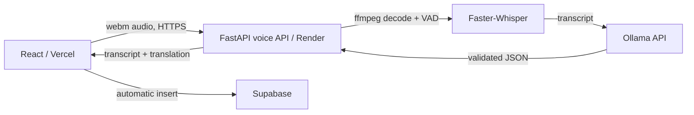

# Voice input architecture

## Deployment split

Deploy the Vite app to **Vercel**. It records audio, then saves the interpreted transaction automatically. Deploy `voice-service` as a Docker web service on **Render** using the included repository-root `render.yaml` blueprint.

Set `VITE_VOICE_API_URL` in Vercel to the Render URL, and set `ALLOWED_ORIGINS` in Render to the exact Vercel production URL (plus preview URLs if needed). Do not put Ollama credentials or URLs beginning with private-network addresses in Vite variables. The browser calls this URL directly; no Vercel rewrite is needed.

Ollama itself is not suitable for Vercel serverless functions: it requires a long-running process and model storage. Run it separately on a GPU/CPU VM (or a second Render persistent/GPU service) and set Render's `OLLAMA_BASE_URL` and `OLLAMA_MODEL`. Keep it private where possible. If the transaction cannot be classified with an amount, the app does not create a partial financial row and asks the user to record a clearer entry.

## Production safeguards

- Faster-Whisper model: `small` is the default CPU compromise. Use `base` for cheaper/faster or `medium` on a GPU worker for higher Hindi accuracy.
- Recordings are capped at 10 MB, written only to a temporary file, and removed after transcription. Do not log recordings or transcripts containing financial data.
- Add application authentication before public launch, plus per-user rate limits at Render/a proxy. The current endpoint is intentionally stateless.
- `voice_payload` stores the original transcript, English translation, and the structured extraction JSON alongside the financial row. The translated note is shown in history.
